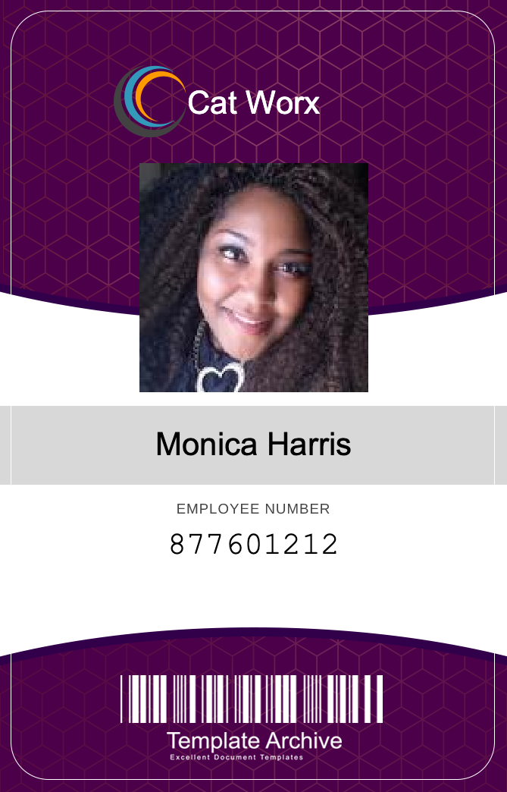

<div id="top"></div>

<!-- PROJECT SHIELDS -->
<!--
*** using markdown "reference style" links for readability.
*** Reference links are enclosed in brackets [ ] instead of parentheses ( ).
*** See the bottom of this document for the declaration of the reference variables
*** https://www.markdownguide.org/basic-syntax/#reference-style-links
-->

<!-- [![Contributors][contributors-shield]][contributors-url]
[![Forks][forks-shield]][forks-url]
[![Stargazers][stars-shield]][stars-url] -->

[![Issues][issues-shield]][issues-url]
[![MIT License][license-shield]][license-url]
[![LinkedIn][linkedin-shield]][linkedin-url]

<!-- PROJECT LOGO -->
<br />
<div align="center">
  <a href="https://github.com/alexgeis/security-badge-creator">
    
  </a>

<h3 align="center">Security Badge Creator</h3>

  <p align="center">
    CLI tool to create employee badge images from employee info (or API)
    <br />
    <a href="https://github.com/alexgeis/security-badge-creator"><strong>Explore the docs »</strong></a>
    <br />
    <br />
    <a class="deployed_link" href="https://github.com/alexgeis/security-badge-creator">View Demo</a>
    ·
    <a href="https://github.com/alexgeis/security-badge-creator/issues">Report Bug</a>
    ·
    <a href="https://github.com/alexgeis/security-badge-creator/issues">Request Feature</a>
  </p>
</div>

<!-- TABLE OF CONTENTS -->
<details>
  <summary>Table of Contents</summary>
  <ol>
    <li>
      <!-- <a href="#about-the-project">About The Project</a> -->
      <ul>
        <li><a href="#built-with">Built With</a></li>
      </ul>
    </li>
    <li>
      <a href="#getting-started">Getting Started</a>
      <ul>
        <li><a href="#prerequisites">Prerequisites</a></li>
        <li><a href="#installation">Installation</a></li>
      </ul>
    </li>
    <li><a href="#usage">Usage</a></li>
    <li><a href="#roadmap">Roadmap</a></li>
    <li><a href="#contributing">Contributing</a></li>
    <li><a href="#license">License</a></li>
    <li><a href="#contact">Contact</a></li>
    <li><a href="#acknowledgments">Acknowledgments</a></li>
  </ol>
</details>

<!-- ABOUT THE PROJECT -->

<!-- ## About The Project -->

<!-- [![Product Name Screen Shot][product-screenshot]](https://example.com) -->
<!-- <a class="deployed_link" href="https://example.com">
<p align="center">
</p></a> -->

<!-- <p align="right">(<a href="#top">back to top</a>)</p> -->

### Built With

- [C#](https://learn.microsoft.com/en-us/dotnet/csharp/)

<p align="right">(<a href="#top">back to top</a>)</p>

<!-- GETTING STARTED -->

## Getting Started

Instructions on setting up your project locally.
To get a local copy up and running follow these simple example steps.

### Prerequisites

This is an example of how to list things you need to use the software and how to install them.

First, install the .NET environment version 6+.

### Installation

1. Clone the repo
   ```sh
   git clone https://github.com/alexgeis/security-badge-creator.git
   ```
2. Install .NET environment (https://dotnet.microsoft.com/en-us/download)
3. Run "dotnet run" to start the application
   ```sh
   cd CatWorx.BadgeMaker
   dotnet run
   ```

<p align="right">(<a href="#top">back to top</a>)</p>

<!-- USAGE EXAMPLES -->

## Usage

Simply follow the CLI prompts to add employee info and you'll find created badges in the CatWorx.BadgeMaker/data/ directory as .png assets.

<!-- _For more examples, please refer to the [Documentation](https://example.com)_ -->

<p align="right">(<a href="#top">back to top</a>)</p>

<!-- ROADMAP -->

## Roadmap

- [ ] - upload images to an online service like Google Drive or Imgur (https://apidocs.imgur.com/)
- [ ] - save employee info in a MySQL database
- [ ] - add a default photo if one doesn't exist for any given user
- [ ] - input for company name

See the [open issues](https://github.com/alexgeis/security-badge-creator/issues) for a full list of proposed features (and known issues).

<p align="right">(<a href="#top">back to top</a>)</p>

<!-- CONTRIBUTING -->

## Contributing

Any contributions you make are **greatly appreciated**.

Please try to create bug reports that are:

- _Reproducible_. Include steps to reproduce the problem.
- _Specific_. Include as much detail as possible: which version, what environment, etc.
- _Unique_. Do not duplicate existing opened issues.
- _Scoped_ to a Single Bug. One bug per report.

If you have a suggestion that would make this better, please fork the repo and create a pull request. You can also simply open an issue with the tag "enhancement".
Don't forget to give the project a star! Thanks again!

1. Fork the Project
2. Create your Feature Branch (`git checkout -b feature/AmazingFeature`)
3. Commit your Changes (`git commit -m 'Add some AmazingFeature'`)
4. Push to the Branch (`git push origin feature/AmazingFeature`)
5. Open a Pull Request

<p align="right">(<a href="#top">back to top</a>)</p>

<!-- LICENSE -->

## License

Distributed under the MIT License. See `LICENSE.txt` for more information.

<p align="right">(<a href="#top">back to top</a>)</p>

<!-- CONTACT -->

## Contact

Alex Geis - siegxela@gmail.com

Project Link: [https://github.com/alexgeis/security-badge-creator](https://github.com/alexgeis/security-badge-creator)

<p align="right">(<a href="#top">back to top</a>)</p>

<!-- ACKNOWLEDGMENTS -->

## Acknowledgments

Helpful resources and kudos.

- [Random User Generator API](https://randomuser.me/documentation)

<p align="right">(<a href="#top">back to top</a>)</p>

<!-- MARKDOWN LINKS & IMAGES -->
<!-- https://www.markdownguide.org/basic-syntax/#reference-style-links -->

<!-- [contributors-shield]: https://img.shields.io/github/contributors/alexgeis/security-badge-creator.svg?style=for-the-badge
[contributors-url]: https://github.com/alexgeis/security-badge-creator/graphs/contributors
[forks-shield]: https://img.shields.io/github/forks/alexgeis/security-badge-creator.svg?style=for-the-badge
[forks-url]: https://github.com/alexgeis/security-badge-creator/network/members
[stars-shield]: https://img.shields.io/github/stars/alexgeis/security-badge-creator.svg?style=for-the-badge
[stars-url]: https://github.com/alexgeis/security-badge-creator/stargazers -->

[issues-shield]: https://img.shields.io/github/issues/alexgeis/security-badge-creator.svg?style=for-the-badge
[issues-url]: https://github.com/alexgeis/security-badge-creator/issues
[license-shield]: https://img.shields.io/github/license/alexgeis/security-badge-creator.svg?style=for-the-badge
[license-url]: https://github.com/alexgeis/security-badge-creator/blob/master/LICENSE.txt
[linkedin-shield]: https://img.shields.io/badge/-LinkedIn-black.svg?style=for-the-badge&logo=linkedin&colorB=555
[linkedin-url]: https://linkedin.com/in/alexngeis
[product-screenshot]: images/screenshot.png
